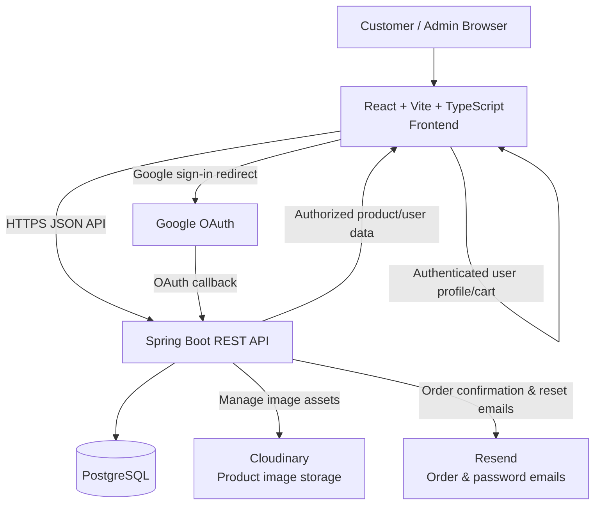
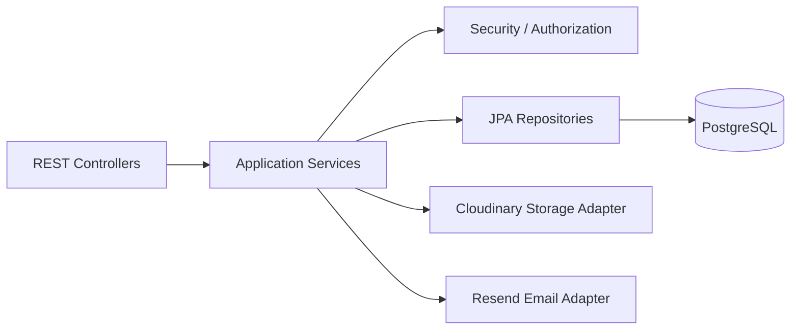
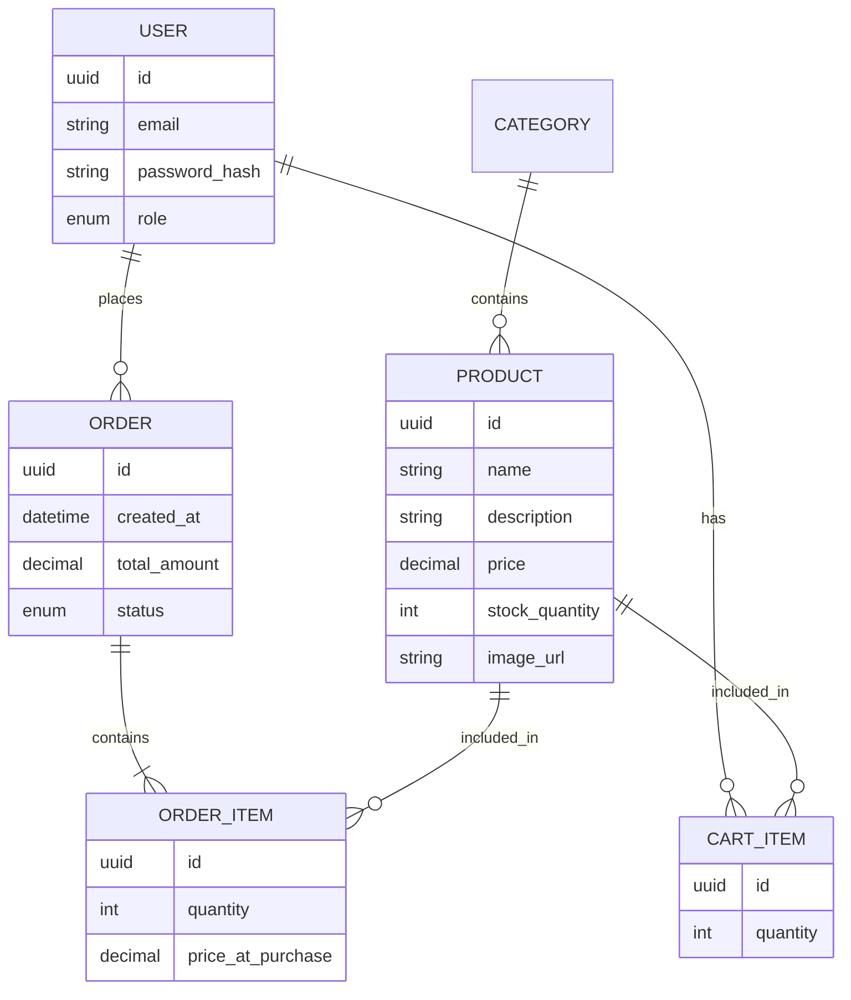

# System Architecture — Medicine Shop Platform

## Architecture overview

## Frontend architecture

Use React as a single-page application (eventually), currently organized by feature folders to ensure modularity.

- **Authentication:** registration, email verification, login, Google sign-in, password reset, token/session handling, protected routes.
- **Catalog:** searchable/filterable inventory using category, brand, price, and stock availability.
- **Cart & Checkout:** persistent cart state, address management, payment integration placeholder, and order summary.
- **User Dashboard:** order history, personal address book, and profile settings.
- **Admin:** product management (CRUD), stock monitoring, and order status updates.
- **Shared layer:** typed API client, authentication state, reusable UI components, error handling, loading states.

## Backend architecture

Structure Spring Boot as a modular monolith for v1.

## Data architecture

## Key request flows

### Product Discovery
1. Customer filters inventory by category/price.
2. React requests products from Spring Boot.
3. Spring Boot returns products with stock status and images.

### Checkout
1. Customer adds items to cart (managed in LocalStorage/State).
2. Customer proceeds to checkout; React posts order to Spring Boot.
3. Backend validates stock, creates ORDER, deducts stock, and sends email via Resend.
4. React clears cart state.

## Security & Reliability

- Enforce HTTPS, Bcrypt hashing, and Spring Security.
- Admin-only access to inventory management.
- Backend validates all stock levels during order processing (never trust frontend).
- Sensitive credentials via environment variables.

## Deployment topology
- **Frontend:** Vercel/Netlify.
- **Backend:** Spring Boot on cloud host.
- **Database:** Managed PostgreSQL.
